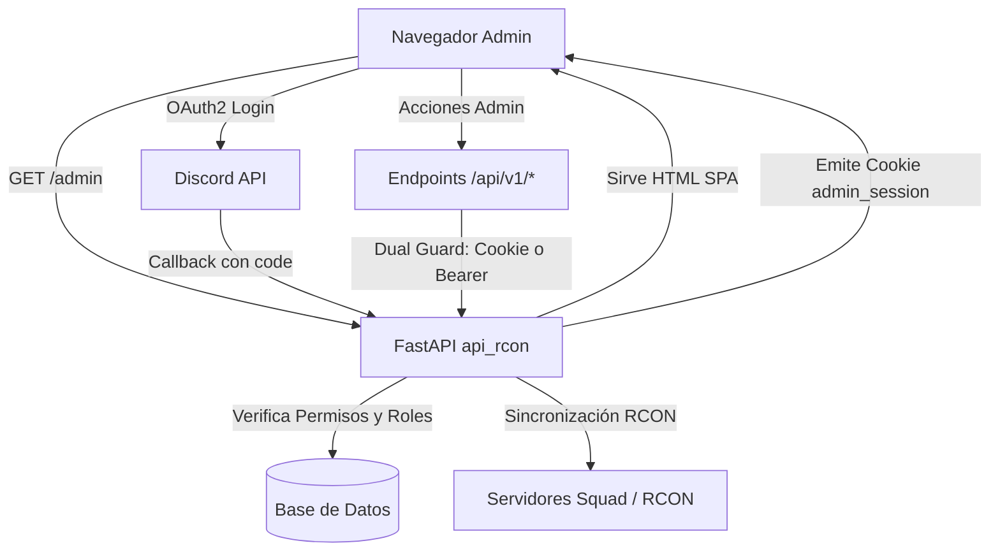

# Panel de Administración (Admin Dashboard)

El **Admin Dashboard** es una aplicación SPA (Single Page Application) *Zero-Build* integrada de forma nativa en el backend `apps/api_rcon`. Su propósito es proporcionar a los administradores y moderadores una interfaz visual moderna, inspirada en Discord, para gestionar parámetros del bot, servidores de juego (RCON), membresías, roles y sanciones en tiempo real sin requerir comandos de chat.

---

## 1. Arquitectura y Filosofía de Diseño

- **Zero-Build SPA**: Embebida en `pages/admin/index.html` y servida directamente por FastAPI (`/admin` y `/api/v1/admin`). No requiere Node.js, Webpack, npm ni contenedores adicionales en el despliegue.
- **Estética Discord Dark Theme**: Paleta de colores nativa de Discord (`#1e1f22`, `#2b2d31`, `#313338`, `#5865F2`) con layout de canales, riel de servidores y modales de configuración.
- **Dual-Auth Guard**: La misma API sirve a la comunicación máquina a máquina del bot (`X-API-Key`) y a la interacción web del administrador mediante cookies HttpOnly firmadas con HMAC-SHA256 (`admin_session`) o encabezados `Bearer`.



---

## 2. Flujo de Autenticación y Autorización

### Discord OAuth2

1. **Inicio de sesión**: El usuario accede a `/admin` y hace clic en "Iniciar Sesión con Discord".
2. **CSRF Protection**: Se genera un token aleatorio criptográfico (`state`), almacenado en una cookie temporal `oauth_state` con `HttpOnly` y `SameSite=Lax`.
3. **Redirección a Discord**: Solicita los scopes:
   - `identify`: ID de usuario, nombre de usuario y avatar.
   - `guilds`: Lista de servidores donde participa el usuario.
   - `guilds.members.read`: Roles que posee en el servidor configurado.
4. **Verificación de Privilegios (`DiscordOAuthService.verify_admin_status`)**:
   El usuario debe cumplir al menos **una** de las siguientes condiciones en el servidor objetivo (`DISCORD_GUILD_ID`):
   - Ser el **Propietario del servidor** (`guild.owner == True`).
   - Poseer el permiso nativo de **Administrador en Discord** (bitmask `0x8`).
   - Poseer al menos un rol asignado cuyo tipo en la base de datos sea `SYSTEM` o comience con `SYSTEM` (ej. `SYSTEM_ADMIN`, `SYSTEM_MOD`).
   - Poseer el rol configurado como `ADMIN_ROLE_ID` u `OWNER_ROLE_ID` en `bot_config`.
5. **Generación de Sesión HMAC**:
   Si es admitido, se genera un token `payload.signature` con expiración (7 días por defecto) firmado con `ADMIN_SESSION_SECRET` y se almacena en la cookie `admin_session`.

### Steam OpenID 2.0 (Vinculación y Desvinculación de Administrador)

Los administradores autenticados pueden presionar **"+ Vincular Steam"** en la barra inferior del dashboard.
- Utiliza el protocolo estándar **OpenID 2.0** de Valve Steam Community (con soporte tanto para `openid.claimed_id` como `openid.identity`, aceptando terminación SSL `https://` y proxies locales `http://`).
- Al retornar a `/api/v1/admin/auth/steam/callback`, el backend valida criptográficamente la firma con los servidores de Valve (`check_authentication`).
- **Manejo de Conflictos**: Si el Steam ID devuelto ya se encuentra vinculado a otra cuenta de Discord en la tabla `players`, el sistema **rechaza** la vinculación, no compromete la sesión del administrador y emite un mensaje descriptivo (`?error=steam_conflict`).
- **Sincronización Automática de Rol**: Al vincular con éxito, se asigna automáticamente el rol verificado en Discord configurado en `LINK_ROLE_ID`.
- **Desvinculación Segura (`POST /api/v1/admin/auth/steam/unlink`)**: El administrador puede hacer clic en su Steam pill para desvincular su cuenta. Esto desvincula el jugador en la base de datos, remueve el rol `LINK_ROLE_ID` en Discord y regenera la cookie de sesión sin los datos de Steam.

---

## 3. Variables de Entorno (.env)

Configura las siguientes variables en tu archivo `.env` (`.env.local`, `.env.dev` o `.env.prod`):

```bash
# ====================================================================
# DISCORD OAUTH2 (ADMIN DASHBOARD)
# ====================================================================
# Obtenidos del Discord Developer Portal (Applications -> OAuth2)
DISCORD_CLIENT_ID="123456789012345678"
DISCORD_CLIENT_SECRET="tu_client_secret_aqui"

# URL pública o local del callback OAuth2
# En local: http://localhost:8000/api/v1/admin/auth/discord/callback
# En producción: https://api.tudominio.com/api/v1/admin/auth/discord/callback
DISCORD_REDIRECT_URI="http://localhost:8000/api/v1/admin/auth/discord/callback"

# ID del servidor de Discord oficial para validar administradores y roles SYSTEM
DISCORD_GUILD_ID="123456789012345678"

# Token del bot de Discord (para verificación de miembros y asignación de roles)
DISCORD_TOKEN="tu_discord_bot_token"

# Secreto para firmar tokens de sesión HMAC del dashboard (mínimo 32 caracteres)
ADMIN_SESSION_SECRET="genera_un_string_largo_y_seguro_con_openssl_rand_hex_32"
```

> [!TIP]
> Si `ADMIN_SESSION_SECRET` no se especifica, el sistema utilizará como fallback `API_KEY`. Se recomienda encarecidamente definir un secreto dedicado en entornos de producción.

---

## 4. Secciones del Dashboard

| Sección | Descripción | Acciones disponibles |
| :--- | :--- | :--- |
| **General y Canales** | Parámetros del bot, canales y roles Staff. | Configurar `GUILD_ID`, `ANNOUNCEMENT_CHANNEL_ID`, `MATCH_ANNOUNCE_CHANNEL_ID`, `ADMIN_ROLE_ID`, `OWNER_ROLE_ID`, `LINK_ROLE_ID`. Guardado en lote con barra flotante de cambios. |
| **Roles y Mapeos DDD** | Gestión de roles de dominio del servidor. | Crear nuevos roles (`VIP`, `SYSTEM`, `SPECIAL`, `PUNISHMENT`), asociar `discord_role_id`, copiar IDs al portapapeles. |
| **Mapeos de Sanción** | Roles asignados automáticamente al banear. | Asignar roles de Discord por días de baneo (`BAN_ROLE_<dias>`, ej: `BAN_ROLE_7`, `BAN_ROLE_0` para permanentes) y rol por defecto. |
| **Membresías y Cupos** | Control de stock y límites VIP. | Visualizar paquetes, precio, duración en días, cantidad de activos en tiempo real y editar cupo máximo (`max_quota`). |
| **Whitelist de Seguridad** | Protección contra desincronización. | Agregar y remover Discord IDs protegidos de la eliminación automática de roles VIP. |
| **RCON y Servidores** | Estado de los servidores de juego. | Comprobar latencia y conectividad RCON (`test_server`), listar y añadir slots reservados (incluyendo botón "Añadir mi Steam ID"). |
| **Bans y Moderación** | Control de sanciones en juego y base de datos. | Listar bans activos y revocados, aplicar nuevo baneo por Steam ID con duración en días y motivo, revocar sanciones (`unban`). |

---

## 5. Referencia de Endpoints del Dashboard

| Método | Endpoint | Autenticación | Descripción |
| :--- | :--- | :--- | :--- |
| `GET` | `/admin` | Pública | Sirve la interfaz gráfica SPA con cabeceras anti-clickjacking. |
| `GET` | `/api/v1/admin` | Pública | Alias de la interfaz gráfica. |
| `GET` | `/api/v1/admin/auth/discord/login` | Pública | Redirige al flujo de autorización de Discord con cookie de estado CSRF. |
| `GET` | `/api/v1/admin/auth/discord/callback` | Pública | Valida CSRF y permisos de admin, emite cookie de sesión. |
| `GET` | `/api/v1/admin/auth/me` | Sesión Admin | Retorna información del admin autenticado y estado de vinculación. |
| `POST`| `/api/v1/admin/auth/logout` | Sesión Admin | Elimina la cookie de sesión y cierra el acceso. |
| `GET` | `/api/v1/admin/auth/steam/link` | Sesión Admin | Inicia flujo OpenID 2.0 hacia Valve Steam Community. |
| `GET` | `/api/v1/admin/auth/steam/callback` | Sesión Admin | Valida firma OpenID, actualiza DB, asigna `LINK_ROLE_ID` y vincula Steam ID en la sesión. |
| `POST`| `/api/v1/admin/auth/steam/unlink` | Sesión Admin | Desvincula cuenta de Steam en BD, remueve `LINK_ROLE_ID` en Discord y limpia la sesión. |

---

## 6. Despliegue en Producción, Proxy Inverso y Seguridad

Cuando el backend se ejecuta detrás de proxies inversos como **Nginx**, **Traefik**, **Caddy** o **Cloudflare**:

1. **Cabeceras de Seguridad HTTP**: Todas las respuestas que sirven la SPA inyectan:
   - `X-Frame-Options: SAMEORIGIN` (previene ataques de Clickjacking).
   - `X-Content-Type-Options: nosniff` (previene MIME sniffing).
   - `Referrer-Policy: strict-origin-when-cross-origin` (protege URLs de referencia sensibles).
2. **Detección de HTTPS en Proxies Encadenados**: El método `_get_proto` y `_is_secure_request` procesa cabeceras encadenadas separadas por comas (`x-forwarded-proto: https, http`), garantizando que la cookie `admin_session` active el atributo `Secure` correctamente.
3. **Resolución de Host**: El método `_get_base_url` prioriza `x-forwarded-host`, seguido por el encabezado `Host` y finalmente `url.netloc`, ignorando valores placeholder de plantillas `.env` no configuradas.
4. **Configuración recomendada de Nginx**:
   ```nginx
   location / {
       proxy_pass http://127.0.0.1:8000;
       proxy_set_header Host $host;
       proxy_set_header X-Real-IP $remote_addr;
       proxy_set_header X-Forwarded-For $proxy_add_x_forwarded_for;
       proxy_set_header X-Forwarded-Proto $scheme;
       proxy_set_header X-Forwarded-Host $host;
   }
   ```
5. **Redirect URI en Discord**: Asegúrate de agregar exactamente en Discord Developer Portal:
   `https://tu-dominio.com/api/v1/admin/auth/discord/callback`

---

## 7. Resolución de Problemas Frecuentes

- **`error=csrf_invalid`**: Las cookies entre el inicio de sesión y el callback no coinciden. Ocurre si la URL base cambió (ej. de `localhost` a `127.0.0.1`), si el navegador bloquea cookies de terceros, o si transcurrieron más de 10 minutos.
- **`error=unauthorized`**: El usuario autenticado en Discord no tiene permiso nativo de Administrador ni posee ningún rol registrado en la tabla `roles` con `role_type = 'SYSTEM'` en el servidor configurado.
- **`error=steam_conflict`**: El Steam ID que se intenta vincular ya pertenece a otro usuario registrado en la base de datos.
- **`error=config_missing`**: Falta configurar `DISCORD_CLIENT_ID` o `DISCORD_CLIENT_SECRET` en el `.env`.
