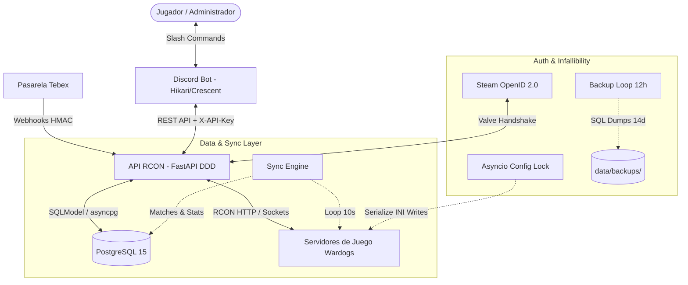

# Arquitectura del Ecosistema Matefield Bot

El ecosistema de Matefield Bot está compuesto por microservicios desacoplados pero estrechamente coordinados. Este diseño aplica los principios de **Separation of Concerns (SoC)** y **Domain-Driven Design (DDD)** para aislar la persistencia en base de datos, la interacción con el motor de juego (RCON) y la interfaz de usuario en Discord.

---

## 1. Componentes del Sistema

### 1.1. API RCON (`apps/api_rcon`)
Es el cerebro operativo del sistema. Desarrollada con **FastAPI** y **SQLModel** asíncrono sobre PostgreSQL (`asyncpg`).
- **Arquitectura DDD (v1)**:
  - **Routers (`src/modules/v1/routers/`)**: Endpoints limpios desacoplados de la lógica de negocio, protegidos mediante el guard `verify_api_key_guard` (`X-API-Key`).
  - **Servicios (`src/modules/v1/services/`)**: Lógica pura de dominio (`bans_service`, `memberships_service`, `players_service`, `server_service`, `tebex_webhook_service`, `membership_types_service`).
  - **DTOs & Schemas (`packages/wardogs_schemas`)**: Contratos de datos fuertemente tipados compartidos entre la API y el Bot de Discord.
- **Multi-RCON Manager (`src/connections/apis/rcon.py`)**:
  - Administra múltiples servidores de juego registrados en la tabla `rcon_servers`.
  - Provee selección dinámica del servidor por ID o por flag `is_default`.
  - Dispone de un semáforo/mutex (`_config_lock`) por servidor para serializar todas las operaciones de lectura y modificación del archivo `ServerSettings.ini`.
- **Motor de Sincronización (`sync_engine.py`)**:
  - Telemetría de partidas en curso (mapa, ticks, kills, muertes, cash).
  - Cierre y consolidación atómica de partidas (`Match`, `MatchTeamStats`, `MatchPlayerStats`) con `flush` antes de `commit` para garantizar integridad relacional.

### 1.2. Discord Bot (`apps/discord_bot`)
Capa de interfaz y control para la comunidad y la administración. Construida en **Python 3.12+** utilizando **Hikari** y **Crescent**.
- **Plugins por Dominio (`src/plugins/`)**:
  - `account.py`: Vinculación de cuentas Steam/Discord (OpenID o manual).
  - `admin.py`: Herramientas de moderación, kick, ban, y gestión de slots reservados.
  - `memberships.py`: Administración de suscripciones VIP, extensiones, compensaciones y exportaciones.
  - `roles.py`: Catálogo de roles de dominio (SYSTEM, VIP, PUBLIC, SPECIAL).
  - `match.py` & `stats.py`: Consulta de estadísticas, partidas activas y perfiles de jugadores.
  - `config.py` & `servers.py`: Parámetros operativos y balanceo de servidores Multi-RCON.
- **Monitores Automatizados (`src/plugins/tasks.py`)**:
  - `membership_monitor` (cada 5m): Sincroniza membresías de DB a roles de Discord. Cuenta con soporte multi-servidor (Multi-Guild) y respeta listas blancas (`SYNC_WHITELIST`).
  - `sync_ban_roles` (cada 5m): Descarga baneos de RCON a DB y alinea roles de sanción en Discord en todas las guilds donde opera el bot.
  - `check_expired_bans` (cada 1m): Detecta sanciones caducadas, ejecuta el desbaneo en RCON/DB, retira el rol de ban y restituye el rol de desbaneo (`BAN_UNSET_ROLE_ID`).
  - `match_monitor` (cada 10s): Detecta finalización de partidas, premia al MVP con 1 día VIP y actualiza la presencia de Discord con el mapa y cantidad de jugadores online.
  - `hacker_monitor_task` (cada 5s): Monitorea la tasa de Kills por Minuto (KPM) de jugadores sospechosos en un embed en vivo.

### 1.3. Mock de Pruebas RCON (`apps/rcon_mock`)
Servidor mock en FastAPI que replica la API RCON oficial de Wardogs (CL-501228). Permite correr tests de integración de extremo a extremo y suites locales (`docker-compose.local.yml`) con 100% de paridad funcional.

---

## 2. Infallibilidad y Robustez de Datos

### 2.1. Concurrencia RCON y Persistencia de Membresías VIP (RCON Lock & Normalization)
- **Comportamiento Empírico del Servidor (CL-501228 / warcon_api.md)**:
  - De acuerdo con la documentación técnica y las pruebas en producción (`docs/warcon_api.md:54`), la lista `DefaultReservedPlayerIds` **no tiene límite de longitud** en el servidor de juego (verificado actualmente con más de 160 VIPs registrados en vivo en RCON).
  - El parámetro `MaxReservedSlots` en `ServerSettings.ini` no limita la cantidad de VIPs en la lista, sino únicamente cuántos espacios de jugadores públicos se retienen para permitirles saltar la cola de espera de conexión.
  - **Causa Real de las Fluctuaciones Previas**:
    - Las tareas en segundo plano (`sync_memberships` y `sync_bans`) corrían de forma concurrente cada 5 minutos.
    - Ambas leían `GET /v1/config`, modificaban su bloque correspondiente y enviaban `PUT /v1/config?force=true&fullApply=true` compitiendo entre sí con revisiones obsoletas, sobreescribiendo alternadamente los cambios de la otra tarea.
    - La inserción de saltos de línea mezclados (`\r\n` vs `\n`) generaba corrupción o líneas truncadas en la lectura del motor Unreal Engine.
- **Solución Implementada**:
  - Se introdujo `_config_lock` (`asyncio.Lock()`) por cliente RCON. Toda lectura y escritura en `ServerSettings.ini` se serializa de manera estricta y atómica.
  - Se normalizan los saltos de línea (`\r\n` -> `\n`) antes y después de manipular arrays INI (`!ClearArray` y `.DefaultReservedPlayerIds=...`).
  - Las rutinas de sincronización preservan la totalidad de registros activos de la base de datos PostgreSQL, garantizando la persistencia íntegra de todos los VIPs sin pérdida de datos.

### 2.2. Prevención de Resurrección de Baneos (Ban Anti-Resurrection)
- **Problema Raíz**: Jugadores desbaneados por la administración continuaban en la lista residual de RCON. En el siguiente ciclo de sincronización, la API interpretaba que eran baneos nuevos de RCON y los volvía a insertar como activos en DB.
- **Solución Implementada**:
  - `bans_service.sync_bans()` rastrea jugadores con baneos históricos inactivos (`is_active = False` y `unbanned_at != None`).
  - Si un Steam ID perdonado aparece en RCON, se purga de inmediato en el servidor de juego con `DELETE /v1/bans/{steamId}` sin reactivarlo en DB.

### 2.3. Optimización de Consultas N+1 en Sincronización
- **Problema Raíz**: `sync_memberships_logic()` ejecutaba consultas individuales por cada jugador vinculado para obtener sus membresías y roles especiales. Con cientos de jugadores, generaba miles de queries secuenciales hacia la base de datos remota.
- **Solución Implementada**:
  - Se sustituyeron las consultas iterativas por **2 consultas por lotes (bulk)** con agrupamiento en memoria (`dict[steam_id -> memberships]` y `dict[steam_id -> roles]`).
  - Reducción de tiempo de ejecución de ~3.5s a < 25ms, eliminando contención de bloqueos.

### 2.4. Soporte Multi-Guild Seguro
- Todas las rutinas de asignación y remoción de roles en Discord (`sync_ban_roles`, `check_expired_bans`, `membership_monitor`) iteran dinámicamente sobre todas las guilds gestionadas donde existan los roles correspondientes, evitando dependencias del orden arbitrario de diccionarios en caché.

---

## 3. Seguridad y Autenticación

1. **API Interna (Bot <-> API)**:
   - Encabezado HTTP `X-API-Key: <TOKEN>`. Verificación a nivel de middleware/dependency.
2. **Servidor de Juego RCON**:
   - Autenticación HTTP Bearer `Authorization: Bearer <RCON_PASSWORD>`.
3. **Webhooks de Tebex**:
   - Doble verificación de firma criptográfica HMAC-SHA256:
     - Firma oficial Tebex: `HMAC-SHA256(secret, sha256(raw_body).hexdigest())`.
     - Firma directa de contingencia: `HMAC-SHA256(secret, raw_body)`.
   - Registro de transacciones procesadas en `payment_records` para garantizar idempotencia y evitar dobles activaciones.
4. **Vinculación de Cuentas Steam**:
   - Generación de token temporal con HMAC-SHA256 (`create_steam_link_token`) con expiración estricta de 10 minutos.
   - Handshake directo con servidores de Valve (`https://steamcommunity.com/openid/login`).
   - Al completar la vinculación, se consultan sanciones pendientes y se aplican los roles correspondientes en Discord inmediatamente.

---

## 4. Esquema de Base de Datos (PostgreSQL 15)

| Tabla | Propósito | Claves / Índices Principales |
|---|---|---|
| `players` | Identidad del usuario (Steam ID <-> Discord ID) | `steam_id` (PK), `discord_id` (Unique, Index) |
| `memberships` | Suscripciones VIP y slots reservados | `id` (PK), `steam_id` (FK, Index), `type` (Index), `is_active` |
| `roles` | Catálogo de roles de dominio (SYSTEM, VIP, PUBLIC, SPECIAL) | `id` (PK), `code` (Unique), `discord_role_id` (Index) |
| `player_roles` | Asociación muchos-a-muchos entre jugadores y roles | `steam_id` (PK, FK), `role_id` (PK, FK) |
| `bans` | Registro histórico de suspensiones RCON/Discord | `id` (PK), `steam_id` (FK, Index), `is_active` |
| `matches` | Registro histórico de partidas completadas | `id` (PK UUID), `map`, `start_time`, `end_time` |
| `match_team_stats` | Puntuaciones por equipo en cada partida | `match_id` (PK, FK), `team_id` (PK, FK) |
| `match_player_stats` | Kills, muertes y cash por jugador en cada partida | `steam_id` (PK, FK), `match_id` (PK, FK) |
| `rcon_servers` | Registro de instancias de servidores de juego | `id` (PK), `name` (Index), `is_active`, `is_default` |
| `payment_records` | Auditoría e idempotencia de transacciones Tebex | `id` (PK), `transaction_id` (Unique, Index), `status` |
| `bot_config` | Almacén dinámico clave-valor de configuraciones | `config_key` (PK) |
