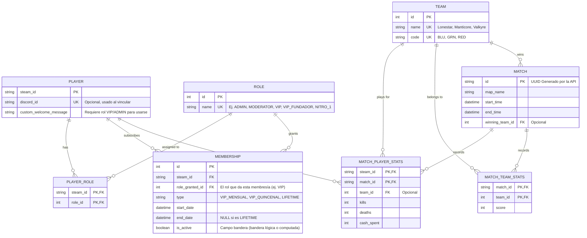

# Arquitectura de Base de Datos - Wardogs

## Modelo Entidad-Relación (ER)

El siguiente diagrama muestra cómo se relacionan las diferentes entidades dentro de la base de datos MySQL usando SQLModel.

## Explicación de Conceptos

1. **RBAC (Role-Based Access Control)**
   - `roles` es la lista de permisos básicos. Un `Player` puede tener varios roles gracias a `player_roles`. Esto permite que alguien sea `ADMIN` y a la vez `VIP_FUNDADOR`.
2. **Membresías (Suscripciones)**
   - `memberships` registra los pagos o suscripciones, incluyendo el *rol que otorgan*. Una persona puede tener 3 meses pagados representados como 3 filas de membresía secuenciales de 30 días, asegurando un historial financiero claro sin romper los permisos actuales. 
   - Las membresías permanentes (como las de los ADMIN) pueden guardarse con tipo `LIFETIME` y `end_date` nulo.
3. **Partidas Históricas**
   - Wardogs no provee IDs de partida nativos, por lo que la API es la que genera un identificador único (UUID). Este UUID enlaza el desempeño global de la partida (`matches`), el desempeño de cada equipo (`match_team_stats`) y el desempeño individual (`match_player_stats`).
