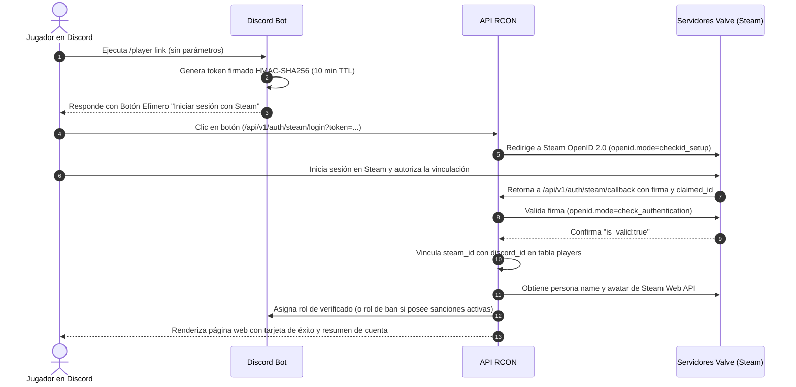

# Autenticación y Vinculación con Steam OpenID

El sistema de vinculación entre Discord y Steam permite verificar la titularidad real de la cuenta de juego sin requerir que los usuarios ingresen credenciales confidenciales en el bot.

## 1. Flujo de Vinculación de Usuario (`/player link`)

---

## 2. Tokens de Vinculación (`steam_token.py`)

Para garantizar que un usuario no pueda vincular la cuenta de Steam de otra persona a su Discord, el enlace generado lleva un token criptográfico:
- **Carga útil codificada en Base64**:
  - `discord_id`: ID del usuario de Discord.
  - `guild_id`: Servidor de Discord desde donde se solicitó.
  - `exp`: Timestamp Unix de expiración (10 minutos desde su emisión).
- **Firma Criptográfica**: HMAC-SHA256 calculado sobre el payload utilizando la clave secreta `API_KEY`.
- **Validación**:
  - Si el token supera los 10 minutos, es rechazado con error `Token de vinculación expirado`.
  - Si la firma no coincide o fue manipulada, se bloquea la solicitud con error `Firma de token inválida`.

---

## 3. Asignación Inmediata de Roles y Detección de Baneos

Al confirmarse la validez de la sesión en Valve:
1. **Detección Preventiva de Sanciones**:
   - La API consulta la tabla `bans` para comprobar si el `steam_id` autenticado posee suspensiones activas en el servidor de juego.
   - Si está sancionado:
     - Asigna automáticamente el rol de ban configurado (`BAN_ROLE_DEFAULT`).
     - Remueve el rol de desbaneo previo (`BAN_UNSET_ROLE_ID`) para aislar al infractor en Discord.
   - Si no está sancionado:
     - Asigna el rol verificado de la comunidad (`LINK_ROLE_ID`).
2. **Actualización de Perfil**:
   - Guarda el avatar oficial de Steam (`avatar_url`) y el nombre de jugador (`in_game_name`).

---

## 4. Vinculación Manual por Administradores

Los administradores disponen del comando `/player link steam_id:<SteamID> usuario:<@User>` para casos especiales de soporte técnico:
- Requiere permisos de administración verificados por el hook `check_is_admin`.
- Vincula directamente las identidades en la base de datos sin pasar por OpenID.
- Aplica las mismas comprobaciones automáticas de roles de sanción y roles de verificación.
