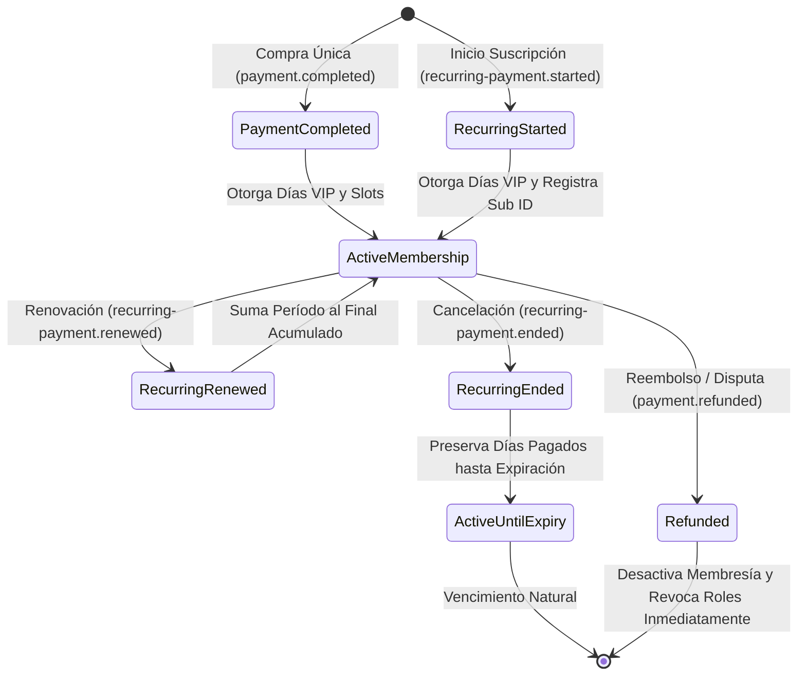

# Pasarela de Pagos Tebex y Webhooks

La integración con Tebex permite la automatización total de compras, activaciones de membresías VIP, renovaciones de suscripciones recurrentes y gestión de reembolsos.

## 1. Seguridad e Idempotencia

### 1.1. Verificación de Firma Webhook
Cada petición POST entrante al endpoint `/api/v1/webhooks/tebex` se valida contra la clave secreta `TEBEX_WEBHOOK_SECRET` mediante HMAC-SHA256:
- **Especificación Oficial de Tebex**:
  ```python
  body_sha256 = hashlib.sha256(raw_body).hexdigest()
  computed = hmac.new(secret.encode(), body_sha256.encode(), hashlib.sha256).hexdigest()
  ```
- **Fallback Directo**: Se valida adicionalmente contra el cuerpo en crudo `hmac.new(secret.encode(), raw_body, hashlib.sha256)`.
- Si las firmas no coinciden, la petición es rechazada de inmediato con HTTP 401.

### 1.2. Idempotencia y Prevención de Duplicados
Todas las transacciones se auditan en la tabla `payment_records` mediante la clave única `transaction_id`. Si Tebex reintenta el envío de un webhook ya procesado con estado `COMPLETED`, el sistema responde con HTTP 200 omitiendo la duplicación de días o beneficios:
```json
{
  "status": "already_processed",
  "transaction_id": "tbx-44326726a1926-4a57f5",
  "event": "recurring-payment.started"
}
```

---

## 2. Eventos Soportados y Ciclo de Vida



### 2.1. `payment.completed` (Compra Única)
1. Extrae identificadores (`steam_id`, `discord_id`, `username`) del payload (`customer` o `products`).
2. Resuelve el tipo de membresía (`MembershipType`) asociado al ID del paquete comprado.
3. Si el jugador ya posee tiempo VIP activo, el nuevo período se **acumula al final** de la fecha existente (`end_time = end_time + timedelta(days=X)`).
4. Sincroniza inmediatamente los slots reservados en RCON y actualiza la tabla `payment_records`.

### 2.2. `recurring-payment.started` (Inicio de Suscripción)
1. Registra la suscripción vinculando `tebex_subscription_id` a la membresía creada.
2. Si el pago inicial ya fue procesado por `payment.completed`, asocia el identificador de suscripción a la membresía activa sin duplicar días.

### 2.3. `recurring-payment.renewed` (Renovación Periódica)
1. Localiza la membresía activa asociada a la referencia de suscripción o al Steam ID.
2. **Preservación de Compensaciones**: Si el jugador tenía días regalados por compensación (`end_time > now`), los nuevos 30 días se suman a partir de la fecha compensada futura, garantizando que el usuario jamás pierda tiempo a favor.
3. Actualiza el estado a `is_active = True` y fuerza la sincronización de roles y slots.

### 2.4. `recurring-payment.ended` / `cancellation.requested` (Cancelación)
1. El usuario cancela su débito automático en Tebex o PayPal.
2. **Regla de No Expiración Prematura**: La membresía **NO** se desactiva inmediatamente si el período prepago aún está vigente (`end_time > now`). El usuario conserva sus accesos in-game y roles en Discord hasta que su último día pagado expire naturalmente.
3. Si la membresía ya no tenía tiempo a favor, se desactiva y se retiran los slots.

### 2.5. `payment.refunded` / `payment.dispute.lost` (Reembolso o Disputa)
1. Se anula la transacción por devolución del dinero.
2. La membresía pasa inmediatamente a `is_active = False` y se purga de los slots reservados de RCON.
3. A diferencia de las cancelaciones comunes, un reembolso **revoca de inmediato cualquier rol especial permanente** que hubiera sido otorgado por ese paquete.
