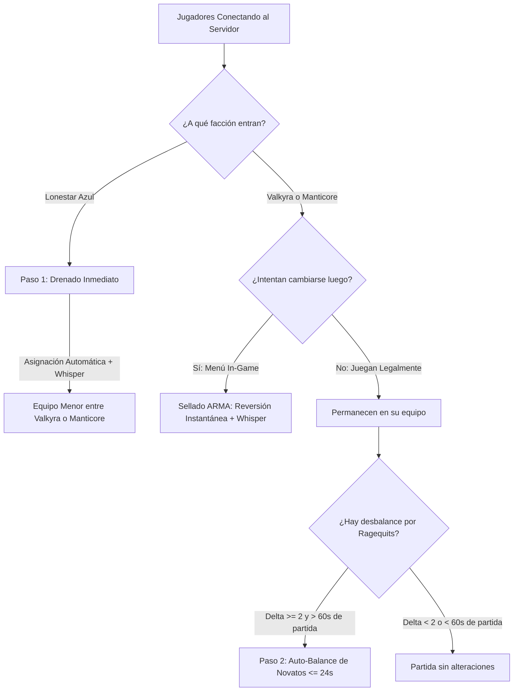

# Manual de Operación y Funcionamiento: Modo 50v50 & Team Balancing
> **Documento Oficial de Referencia para el Equipo de Staff y Moderación**  
> *Versión 2.0 — Sellado Estilo ARMA, Periodo de Gracia, Whispers y Protección de Vehículos*

---

## 1. ¿Qué es el Modo 50v50?

El juego *Wardogs* está diseñado nativamente con una estructura tripartita de **33 vs 33 vs 33** entre tres facciones:
* **Valkyra (Rojo)**
* **Manticore (Verde)**
* **Lonestar (Azul)**

El **Modo 50v50** es un sistema automatizado desarrollado en el bot que transforma la partida en una guerra campal bipartita de **50 vs 50 (Valkyra vs Manticore)**, neutralizando por completo la facción **Lonestar (Azul)** y garantizando un equilibrio justo sin alterar la diversión de los jugadores veteranos ni de los grupos de amigos.



---

## 2. Fundamentos Técnicos: ¿Por qué el Bot y no el Servidor Nativo?

El archivo `ServerSettings.ini` del servidor de juego cuenta con una opción interna llamada:
```ini
[/Script/WDGame.WDGameStateSession]
bLockOverpopulatedTeamsConfig=true
OverpopulatedTeamThresholdConfig=1
```

### ¿Por qué NO usamos el balanceador nativo del juego para 50v50?
1. **Conflicto de 3 facciones**: El servidor de juego evalúa constantemente las **3 facciones**.
2. **Bloqueo involuntario**: Como mantenemos a Lonestar (Azul) en 0 jugadores, en cuanto Valkyra y Manticore tengan 3 o 4 jugadores, el motor del juego detecta que ambos superan a Azul por más de 1 jugador.
3. **El bug de selección**: El servidor nativo **bloquea a Valkyra y Manticore** en la pantalla de carga y **fuerza a todos los jugadores entrantes a meterse a Lonestar (Azul)**, arruinando la experiencia del usuario.
4. **La Solución**: Al activar 50v50, el bot apaga remotamente `bLockOverpopulatedTeamsConfig=false` en el RCON del servidor, tomando el **control inteligente absoluto** del balanceo mediante su propio motor cada 6 segundos.

---

## 3. Ciclo de Vida del Modo: Activación Limpia (`[NEXT MATCH]`)

Los cambios en la configuración del servidor de juego (`ServerSettings.ini`) solo surten efecto cuando una nueva partida comienza o se reinicia el mapa. Por ello, el bot implementa un ciclo de vida diferido de 4 estados para no romper partidas en curso:

| Estado en Base de Datos | Significado | Comportamiento del Bot |
| :--- | :--- | :--- |
| `pending_enable` | El staff ejecutó `/mode50v50 enable`. | El RCON ya queda configurado con el candado nativo en `false`. La automatización espera pacientemente a que termine la partida actual. |
| `active` | La nueva partida inició tras la rotación. | **Modo 50v50 100% activo**: Se emite broadcast global *"Modo 50v50 ACTIVADO"* y el bot balancea activamente cada 6 segundos. |
| `pending_disable` | El staff ejecutó `/mode50v50 disable`. | El RCON se restaura a `true`. Para no estropear la partida en juego, el bot sigue operando en 50v50 hasta que concluya el mapa. |
| `inactive` | Modo apagado. | Estado por defecto (33v33v33 normal). |

> [!NOTE]
> Si el staff activa `pending_enable` por error y luego ejecuta `disable` antes de que cambie el mapa, el bot cancela la activación de forma inmediata sin esperar al cambio de ronda.

---

## 4. Sellado de Equipos Estilo ARMA (Prohibición de Cambio Voluntario)

Inspirado en los servidores tácticos de **ARMA King of the Hill**, los equipos quedan **sellados durante toda la partida**:

1. **Sin Cambios de Conveniencia**: Los jugadores **no pueden** cambiarse voluntariamente de equipo a mitad de partida (por ejemplo, pasarse al bando que va ganando o al bando donde hay mejores vehículos).
2. **Detección Instantánea**: Cada 6 segundos, el bot compara la facción en vivo del jugador con su facción oficialmente asignada (`assigned_faction`).
3. **Reversión Inmediata**: Si detecta que un jugador se cambió de equipo por su cuenta:
   * Ejecuta inmediatamente `switch_faction` regresándolo a su bando asignado.
   * Le aplica un cooldown de 15 segundos para evitar bucles.
   * Le envía un **whisper privado**:
     > 💬 *"Cambio de equipo no permitido durante la partida."*

---

## 5. Sistema de Notificaciones Directas (*Whispers*) por RCON

El bot se comunica directamente con la interfaz del jugador mediante el endpoint oficial `/v1/players/{steam_id}/message`:

| Evento | Mensaje Enviado al Jugador | Razón |
| :--- | :--- | :--- |
| **Intento de cambio manual** | `"Cambio de equipo no permitido durante la partida."` | Informa que el cambio fue bloqueado por la regla de sellado ARMA. |
| **Asignación desde Lonestar (Azul)** | `"Se te ha asignado al equipo {Valkyra/Manticore}."` | Explica por qué fue transferido al salir del lobby azul. |
| **Auto-Balance por desbalance** | `"Se te ha asignado al equipo {Valkyra/Manticore} para balancear la partida."` | Aclara de forma transparente que fue movido para equilibrar los equipos. |
| **Espectadores / Árbitros (`White`/`None`)** | *Ninguno (Silencio total)* | Están 100% aislados y protegidos de cualquier mensaje o transferencia. |

---

## 6. Algoritmo de Team Balancing Inteligente y Justo

El bot ejecuta un ciclo de análisis cada 6 segundos (`mode_50v50_loop`). El algoritmo opera en dos pasos bien diferenciados:

### Paso 1: Drenado Continuo de Lonestar (Azul)
* Cualquier jugador que aparezca en Lonestar (Azul) es transferido al equipo menor entre Valkyra y Manticore.
* Recibe el whisper: *"Se te ha asignado al equipo {target}."*
* **Asimilación como Original**: Una vez asignado, se le registra su `assigned_faction`. Es considerado un miembro oficial legítimo de ese bando.

---

### Paso 2: Auto-Teambalancing Rojo vs Verde
Si la diferencia poblacional entre Valkyra y Manticore es de **2 o más jugadores** ($\Delta \ge 2$), el bot evalúa si corresponde balancear. Sin embargo, para evitar frustraciones y proteger a los jugadores, se aplican **4 salvaguardas estrictas**:

#### Salvaguarda 1: Periodo de Gracia Inicial (*Warmup* de 1 Minuto / 60 Segundos)
* **El Problema**: Los jugadores con discos SSD rápidos cargan en 10 segundos, mientras que sus amigos con HDD o conexiones más lentas tardan 40 segundos. Si 5 amigos entran a Valkyra, en el segundo 20 el servidor está 5v0.
* **La Solución**: Durante los primeros **60 segundos** (`matchSeconds < 60`), el auto-balanceo entre Rojo y Verde está **completamente pausado**.
* **Efecto**: Los grupos de amigos y escuadras pueden cargar el mapa y elegir bando juntos sin miedo a que el bot los separe en el primer minuto.

#### Salvaguarda 2: Regla de Inmunidad Absoluta para Combatientes y Veteranos
* Si un jugador ya participó en el combate de la partida:
  $$\text{cash ganado} > 0 \quad \lor \quad \text{kills} + \text{deaths} > 0$$
* Es **100% INMUNE** a ser cambiado de equipo por abandono de rivales (*ragequits*).
* Si el equipo perdedor sufre una oleada de abandonos y queda en 50 vs 45 veteranos, **EL BOT NO MUEVE A NINGÚN VETERANO**. La partida continúa 50 vs 45 hasta que entren nuevos jugadores al servidor.

#### Salvaguarda 3: Protección de Compras en Base (Regla de los 24 Segundos)
* **El Problema**: En RCON, el dato `cash` solo representa el **dinero ganado por capturar zonas** (`ScorePeriod=30s`). No refleja el dinero disponible en la billetera ni lo gastado en base. Un jugador puede haber gastado \$10.000 en un tanque recién llegado a base y su `cash` ganado aún es \$0.
* **La Solución**: Para ser elegible de ser transferido, el jugador debe llevar **24 segundos o menos en el equipo** (`now_ts - joined_team_at <= 24`).
* **Efecto**: Si un jugador lleva más de 24 segundos en base, el bot lo considera protegido (asume que ya está interactuando con terminales o desplegando en un vehículo). Su dinero y su tanque están 100% a salvo.

#### Salvaguarda 4: Cooldown Anti-Pingpong (60 Segundos)
* Todo jugador que haya sido transferido por el bot recibe una protección de **60 segundos** durante los cuales no puede volver a ser transferido, evitando que rebote entre equipos.

---

## 7. Matriz de Decisiones del Bot

| Perfil del Jugador | `cash` Ganado | K/D | Tiempo en Equipo | ¿El Bot puede moverlo? |
| :--- | :---: | :---: | :---: | :---: |
| **Veterano en combate** | $> \$0$ | Cualquiera | Cualquiera | ❌ **INMUNE (100%)** |
| **Veterano con bajas** | $\$0$ | $\ge 1$ | Cualquiera | ❌ **INMUNE (100%)** |
| **Jugador comprando en base** | $\$0$ | $0/0$ | $> 24$ segundos | ❌ **PROTEGIDO (Evita pérdida de tanques)** |
| **Recién conectado en base** | $\$0$ | $0/0$ | $\le 24$ segundos | ✅ **Elegible para balancear (Recibe whisper)** |
| **Espectador / Árbitro** | Facción `White` o `None` | - | - | ❌ **INTOCABLE (Completamente ignorado)** |
| **Jugador intentando cambio voluntario** | Cualquiera | Cualquiera | Cualquiera | ⛔ **BLOQUEADO (Revertido a su equipo con whisper)** |

---

## 8. Guía de Casos de Uso Reales para el Staff (FAQ)

### Caso 1: *"Entré con 4 amigos en Valkyra y Manticore está vacío (5v0) al empezar la ronda. ¿Nos va a separar el bot?"*
> **Respuesta**: **No**. Durante los primeros 60 segundos de partida (`matchSeconds < 60`), el auto-balanceo está pausado. Todos los amigos pueden entrar juntos y acomodarse en el equipo que prefieran.

### Caso 2: *"A mitad de partida compré un helicóptero o un tanque en base. ¿El bot me puede cambiar de equipo y hacerme perder la plata?"*
> **Respuesta**: **No**. Si ya estuviste en combate, eres inmune por stats. Y si recién te conectaste pero llevas más de 24 segundos en base eligiendo armamento o comprando un vehículo, la regla de los 24 segundos te protege automáticamente.

### Caso 3: *"Manticore va perdiendo y 7 jugadores se salieron por frustración (quedó 50 vs 43). ¿El bot va a pasar a los veteranos de Valkyra?"*
> **Respuesta**: **No**. El bot jamás castiga a los veteranos del equipo ganador. Si todos los jugadores de Valkyra ya combatieron o llevan más de 24 segundos en juego, el bot no mueve a nadie. El balanceo esperará a que ingresen nuevos jugadores al servidor.

### Caso 4: *"Un jugador nuevo conecta al servidor y el juego lo pone en Lonestar (Azul). ¿Qué sucede?"*
> **Respuesta**: En menos de 6 segundos, el bot lo transfiere al equipo con menor cantidad de jugadores (Rojo o Verde) y le manda un whisper privado: *"Se te ha asignado al equipo Valkyra/Manticore"*. A partir de ahí, queda sellado en ese equipo.

### Caso 5: *"Un jugador vivo intenta cambiarse en el menú al equipo que va ganando."*
> **Respuesta**: El bot detecta que su facción cambió sin orden del bot, lo devuelve de inmediato a su facción asignada y le envía un whisper: *"Cambio de equipo no permitido durante la partida."*

### Caso 6: *"Hay moderadores o árbitros en modo espectador (facción White)."*
> **Respuesta**: El bot los filtra inmediatamente antes de procesar cualquier lógica. Nunca se les mueve de facción, nunca se les envía whispers y nunca interfieren en el conteo de 50v50.

---

## 9. Comandos de Administración del Modo

Los administradores pueden gestionar el modo mediante los comandos de Discord o la API RCON:

* `/mode50v50 status`: Muestra el estado actual (`inactive`, `pending_enable`, `active`, `pending_disable`), conteo de jugadores por equipo y configuración de RCON.
* `/mode50v50 enable`: Prepara el modo 50v50 para activarse en el siguiente mapa (`pending_enable`).
* `/mode50v50 disable`: Prepara el apagado ordenado del modo al terminar la partida actual (`pending_disable`).

---
*Manual verificado y probado al 100% contra el Mock RCON oficial con 21 pruebas unitarias y de integración.*
